# LatihanVCS

Repository ini dibuat untuk memenuhi tugas pertemuan ke 4 Bahasa Pemrograman

**Nama       	: Siti Nur Fauziah** 
**NIM	              : 312010032** 
**Kelas	    : TI.20.B1** 
**Dosen	    : Agung Nugroho, M.Kom.** 

## LANGKAH - LANGKAH PENGGUNAAN GIT
1. Langkah pertama tentunya kita harus mempunyai aplikasi Git terlebih dahulu. Sesuaikan dengan sistem operasi yang tersedia di perangkat kita. [Download aplikasi Git](https://git-scm.com/downloads)

    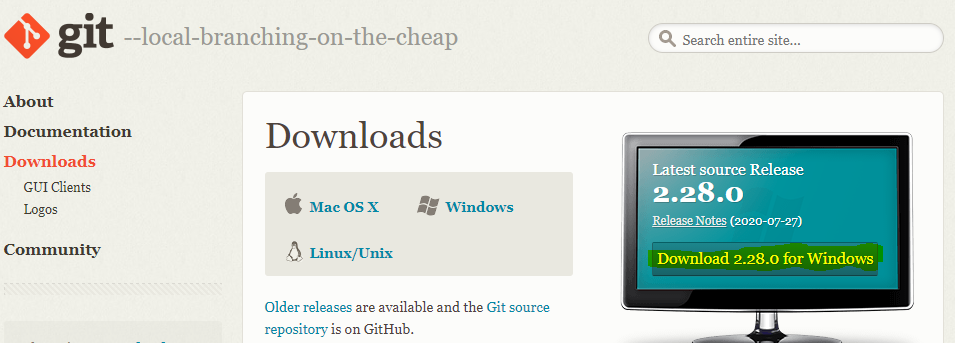

2.  Install aplikasi Git yang sudah di [download](https://git-scm.com/downloads)  tadi mengikuti [referensi instalasi aplikasi git](https://git-scm.com/book/en/v2/Getting-Started-Installing-Git)

    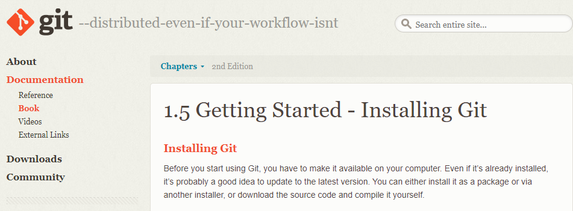

3. Cek versi git, apakah sudah sesuai dengan sistem operasi perangkat kita atau belum dengan perintah <i><u>git --version</u></i> lalu enter.

    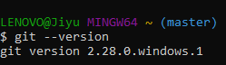

4. Selanjutnya kita setting User dan Email. Dengan perintah <i><u>git config --global user.name "Namaku" </u></i>

    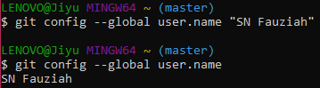

5. Setting email dengan perintah <i><u>git config --global user.email "example@gmail.com" </u></i>

    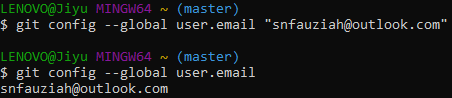

6. Lalu kita buat akun Github pada website [Github.com](https://github.com/)

    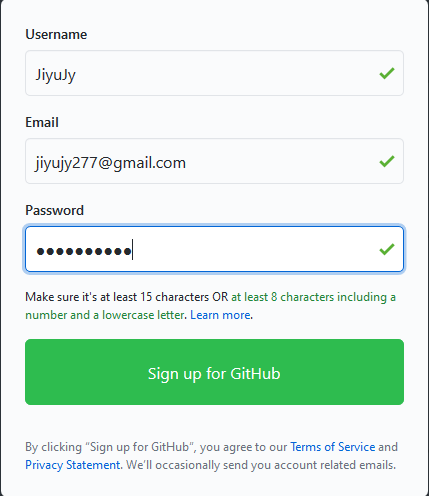

7. Setelah membuat akun github, kita akan ditampilkan halaman awal dari websit Github tersebut, dan kita akan disuruh verifikasi email yang kita daftarkan tadi. Lalu kita buat repository baru dengan mengklik button tambah seperti dibawah

    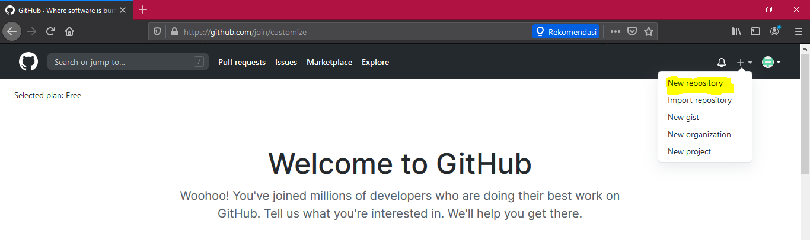

8. Lalu isi format repository yang akan kita buat sesuai dengan kebutuhan kita.

    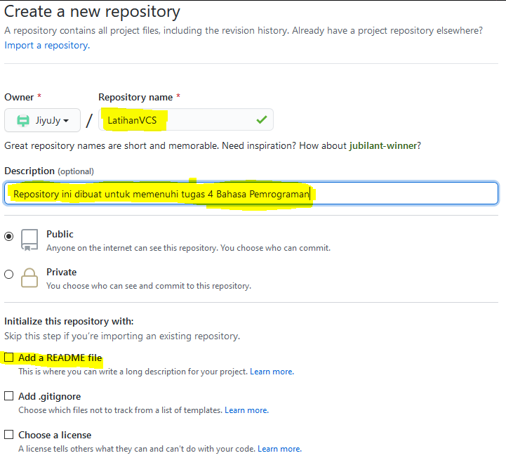

9. Lalu verifikasi akun kita bukan robot.

    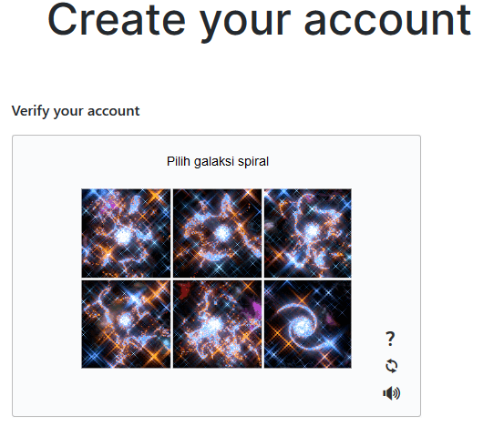

10. Selanjutnya setelah repository sudah jadi, copy link untuk membuat atau menambahkan folder pada penyimpanan lokal

    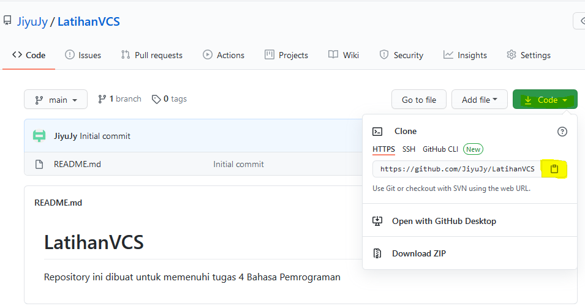

11. Setelah dicopy, kita paste / klik kanan > Git bush here pada penyimpanan lokal yang kita inginkan.

    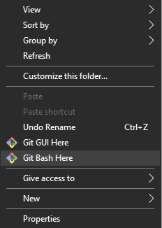

12. Lalu kita akan ditampilkan ke halaman CMD / Command Promp.  ketikkan perintah untuk mengClone copyan git hub ke local tadi dengan perintah <i><u>git clone</u></i>

    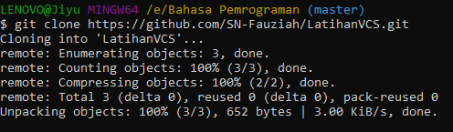

13. Langkah selanjutnya kita buka file README.md menggunakan Notepad / aplikasi codding lainnya pada folder LatihanVCS yang sudah kita buat tadi.

    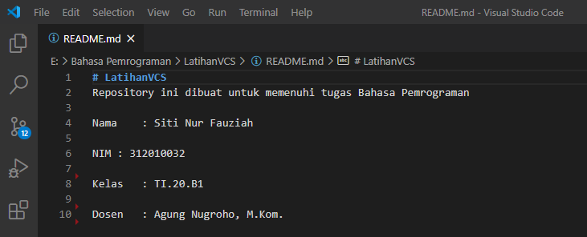

14. Setelah kita menambahkan, mengedit, atau mengisi yang kita mau pada file README.md tadi kita tambahkan perintah untuk mensave settingan yang kita buat tadi dengan perintah <i><u>git add .</u></i>

    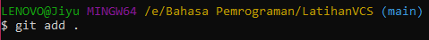

15. Lalu ketikkan perintah selanjutnya <i><u>git commit -m "Update"</u></i>

    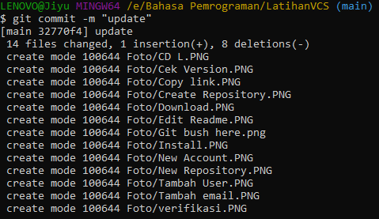

16. Terakhir untuk meng-apply settingan yang kita buat agar dapat ditampilkan di website ketikkan perintah <i><u>git push</u></i>

    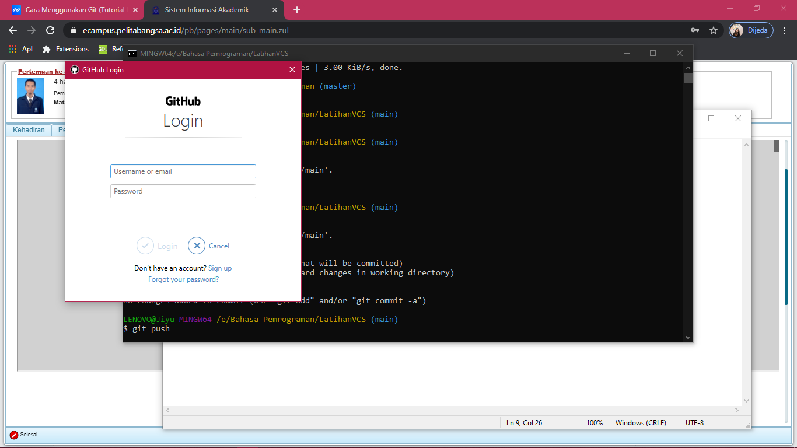

    <i>Untuk akun baru biasanya akan diperintahkan login username yang dibuat tadi , maka kita tinggal masukan usernam/email dan passwordnya saja.</i>

17. Setelah semua langkah yang kita lakukan di atas, jika berhasil maka tampilan website Github akan sesuai dengan settingan yang sudah kita buat tadi.

    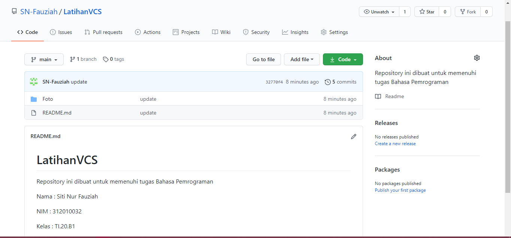

## SELAMAT MENCOBA~~~
